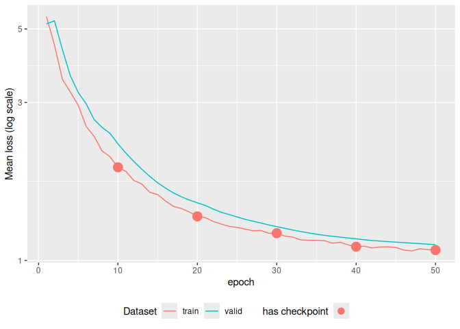

<!-- README.md is generated from README.Rmd. Please edit that file -->

# tabnet

<!-- badges: start -->

[](https://github.com/mlverse/tabnet/actions)
[](https://lifecycle.r-lib.org/articles/stages.html)
[](https://CRAN.R-project.org/package=tabnet)
[](https://cran.r-project.org/package=tabnet)
[](https://discord.com/invite/s3D5cKhBkx)

<!-- badges: end -->

An R implementation of: [TabNet: Attentive Interpretable Tabular
Learning](https://arxiv.org/abs/1908.07442). The code in this repository
is an R port of
[dreamquark-ai/tabnet](https://github.com/dreamquark-ai/tabnet)
PyTorch’s implementation using the
[torch](https://github.com/mlverse/torch) package.

## Installation

You can install the released version from CRAN with:

``` r
install.packages("tabnet")
```

The development version can be installed from
[GitHub](https://github.com/mlverse/tabnet) with:

``` r
# install.packages("remotes")
remotes::install_github("mlverse/tabnet")
```

## Basic Binary Classification Example

Here we show a **binary classification** example of the `attrition`
dataset, using a **recipe** for dataset input specification.

``` r
library(tabnet)
suppressPackageStartupMessages(library(recipes))
library(yardstick)
library(ggplot2)
set.seed(1)

data("attrition", package = "modeldata")
test_idx <- sample.int(nrow(attrition), size = 0.2 * nrow(attrition))

train <- attrition[-test_idx,]
test <- attrition[test_idx,]

rec <- recipe(Attrition ~ ., data = train) %>% 
  step_normalize(all_numeric(), -all_outcomes())

fit <- tabnet_fit(rec, train, epochs = 30, valid_split=0.1, learn_rate = 5e-3)
autoplot(fit)
```


The plots gives you an immediate insight about model overfitting, and if
any, the available model checkpoints available before the overfitting

Keep in mind that **regression** as well as **multi-class
classification** are also available, and that you can specify dataset
through **data.frame** and **formula** as well. You will find them in
the package vignettes.

## Model performance results

As the standard method `predict()` is used, you can rely on your usual
metric functions for model performance results. Here we use {yardstick}
:

``` r
metrics <- metric_set(accuracy, precision, recall)
cbind(test, predict(fit, test)) %>% 
  metrics(Attrition, estimate = .pred_class)
#> # A tibble: 3 × 3
#>   .metric   .estimator .estimate
#>   <chr>     <chr>          <dbl>
#> 1 accuracy  binary         0.837
#> 2 precision binary         0.837
#> 3 recall    binary         1
  
cbind(test, predict(fit, test, type = "prob")) %>% 
  roc_auc(Attrition, .pred_No)
#> # A tibble: 1 × 3
#>   .metric .estimator .estimate
#>   <chr>   <chr>          <dbl>
#> 1 roc_auc binary         0.554
```

## Explain model on test-set with attention map

TabNet has intrinsic explainability feature through the visualization of
attention map, either **aggregated**:

``` r
explain <- tabnet_explain(fit, test)
autoplot(explain)
```


or at **each layer** through the `type = "steps"` option:

``` r
autoplot(explain, type = "steps")
```


## Self-supervised pretraining

For cases when a consistent part of your dataset has no outcome, TabNet
offers a self-supervised training step allowing to model to capture
predictors intrinsic features and predictors interactions, upfront the
supervised task.

``` r
pretrain <- tabnet_pretrain(rec, train, epochs = 50, valid_split=0.1, learn_rate = 1e-2)
autoplot(pretrain)
```



The exemple here is a toy example as the `train` dataset does actually
contain outcomes. The vignette on [Unsupervised training and
fine-tuning](https://mlverse.github.io/tabnet/articles/unsupervised_training.html)
will gives you the complete correct workflow step-by-step.

## Missing data in predictors

{tabnet} leverage the masking mechanism to deal with missing data, so
you don’t have to remove the entries in your dataset with some missing
values in the predictors variables.
