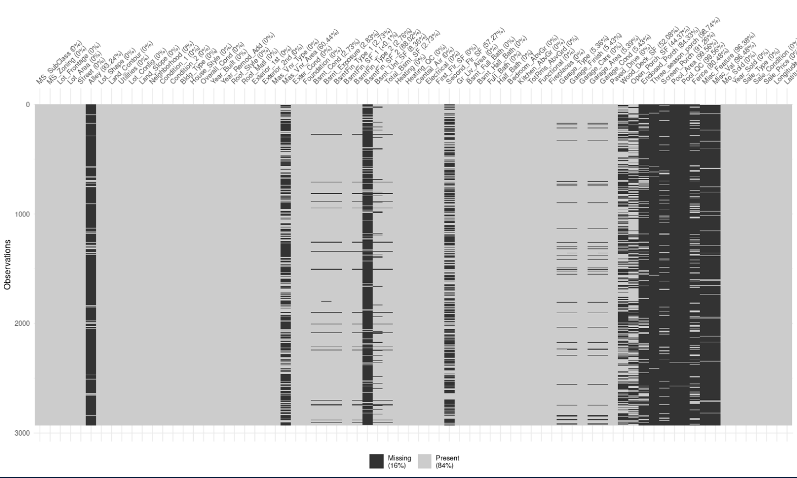
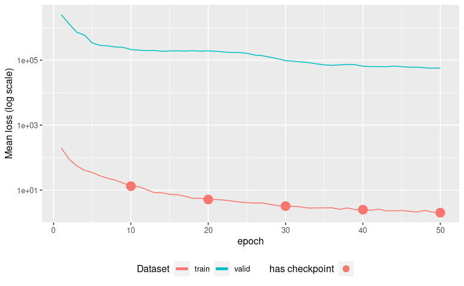
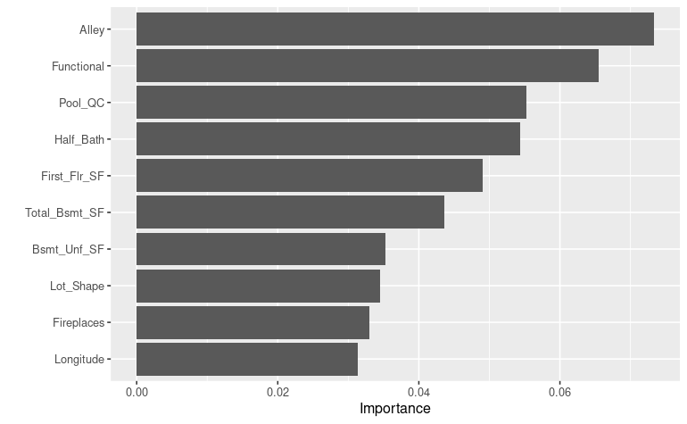
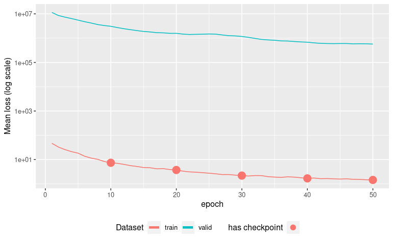
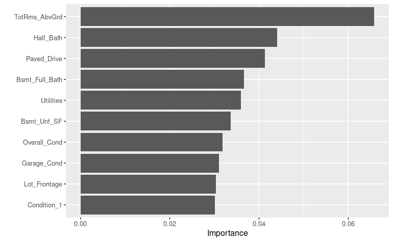
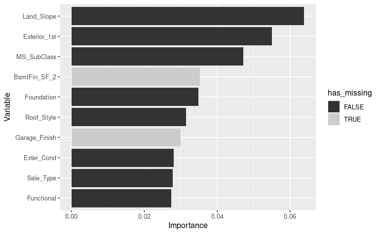
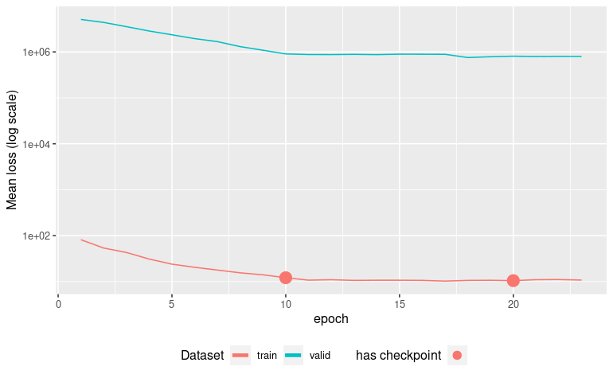

```{r setup, include = FALSE}
knitr::opts_chunk$set(
  collapse = TRUE,
  comment = "#>",
  eval = FALSE
)
```

# Motivation

Real-life training dataset usually contains missing data. The vast majority of deep-learning networks do not handle missing data and thus either stop or crash when values are missing in the predictors.

But Tabnet use a masking mechanism that we can reuse to cover the missing data in the training set.

As we enter the world of missing-data, we have to question the type of missing-data we deal with. We could have missing data at random (MAR), like for example some transmission errors on a sensor data dataset, or missing not at random (MNAR) when some interactions exists between the missing data and other predictors values for the same sample. The later is a more complex topic to cover, and we will try to investigate it here through the `ames` dataset.

# Missing-data dataset creation

## Ames missings understanding

The `ames` dataset from  `{modeldata}`  contains a lot of _null values_ that the human analysis clearly understand as an implicit _"missing object"_ described by that value. We have for example pool surface of 0 square meters means "no pool", basement surface of 0 square meters means "no basement", ...  
Many of those variables can be detected visually by inspecting the distribution of the values like, for example, the `Masonry veneer area` predictor :
```{r}
library(tidymodels, quietly = TRUE)
library(tabnet)
data("ames", package = "modeldata")
qplot(ames$Mas_Vnr_Area)
```

We know that it will be extremely difficult for a model to capture an internal representation of such distribution, and thus we want to avoid the null values to penalize the model internal representation.

## While keeping some room for freedom

Many of those variables come as a pair in the `ames` dataset, one for the qualitative aspect, the other for the quantitative aspect. We have for example `Pool_QC` for pool condition, that has a "no_pool" level with `Pool_Area=0` in that case.  
As human, we have the intuition that knowing if a pool is present is important for the modeling task. So we want the model to get an internal representation of the implicit `has_pool=FALSE` without having it explicit in the dataset. In order to do so, we have to let the model some freedom to infer the "no_pool" state and thus we should not mutate both variables in the pair `Pool_Area=NA` and `Pool_QC=NA` at the same time.  


## Ames with missing data

Let's turn those missing objects data explicitly into `NAs` in an new `ames_missing` dataset :

A quick and dirty way to achieve this on numerical predictors is to `na_if()` zeros on any column which name is related to surface and area.  
Then, according to the keep room for freedom rule, do it carefully on the matching categorical predictors

```{r}
col_with_zero_as_na <- ames %>% 
  select(where(is.numeric)) %>% 
  select(matches("_SF|Area|Misc_Val|[Pp]orch$")) %>% 
  summarise_each(min) %>% 
  select_if(~.x==0) %>% 
  names()
ames_missing <- ames %>% mutate_at(col_with_zero_as_na, na_if, 0) %>% 
  mutate_at("Alley", na_if, "No_Alley_Access") %>% 
  mutate_at("Fence", na_if, "No_Fence") %>% 
  mutate_at(c("Garage_Cond", "Garage_Finish"), na_if, "No_Garage") %>% 
  mutate_at(c("Bsmt_Exposure", "BsmtFin_Type_1", "BsmtFin_Type_2"), na_if, "No_Basement")

visdat::vis_miss(ames_missing)
```


We can see here that variable are not missing at random, and thus we can expect the model to capture the missingness relation during the pretraining phase.

Note: A better way to achieve proper value mutation to explicit NAs would be to also check if the qualitative column in the pair refers to `none` or to zero occurrence of the equipment. But this is beyond the scope of this vignette.

# Model pretraining

Let's pretrain one model for each of those dataset, and analyze variable importance that emerge after the unsupervised representation learning step:   

## Variable importance with raw `ames` dataset

```{r}
ames_rec <- recipe(Sale_Price ~ ., data=ames) %>% 
  step_normalize(all_numeric())

cat_emb_dim <- map_dbl(ames %>% select_if(is.factor), ~log2(nlevels(.x)) %>% round)

ames_pretrain <- tabnet_pretrain(ames_rec, data=ames,  epoch=50, cat_emb_dim = cat_emb_dim,
                            valid_split = 0.2, verbose=TRUE, batch=2930, 
                            early_stopping_patience = 3L, early_stopping_tolerance = 1e-4)
autoplot(ames_pretrain)
```

```
[Epoch 001] Loss: 43.708794 Valid loss: 8066126.500000
[Epoch 002] Loss: 31.463089 Valid loss: 5631984.000000
[Epoch 003] Loss: 23.396217 Valid loss: 3901085.500000
[Epoch 004] Loss: 19.241619 Valid loss: 2947481.750000
[Epoch 005] Loss: 15.032537 Valid loss: 2250338.000000
[Epoch 006] Loss: 12.991020 Valid loss: 1815583.125000
[Epoch 007] Loss: 11.044646 Valid loss: 1533597.875000
[Epoch 008] Loss: 9.114124 Valid loss: 1395840.000000
[Epoch 009] Loss: 8.362211 Valid loss: 1258169.375000
[Epoch 010] Loss: 7.549719 Valid loss: 1064599.500000
[Epoch 011] Loss: 6.808529 Valid loss: 998335.625000
[Epoch 012] Loss: 6.569450 Valid loss: 1047418.500000
[Epoch 013] Loss: 6.606429 Valid loss: 1048583.625000
[Epoch 014] Loss: 6.742617 Valid loss: 993241.312500
[Epoch 015] Loss: 6.806847 Valid loss: 995705.875000
[Epoch 016] Loss: 6.618536 Valid loss: 1026789.625000
[Epoch 017] Loss: 6.593469 Valid loss: 1033726.437500
Early stopping at epoch 017
```



Now we capture the columns with missings, and create a convenience function to color the `vip::vip()` plot output according to the missingness quality of the column

```{r}
col_with_missings <- ames_missing %>%
  summarise_all(~sum(is.na(.))>0) %>%
  t %>% enframe(name="Variable") %>% 
  rename(has_missing="value")

vip_color <- function(object, col_has_missing) {
  vip_data <- vip::vip(object)$data %>% arrange(Importance)
  vis_miss_plus <- left_join(vip_data, col_has_missing , by="Variable") %>%
    mutate(Variable=factor(Variable, levels = vip_data$Variable))
  vis_miss_plus
  ggplot(vis_miss_plus, aes(x=Variable, y=Importance, fill=has_missing)) +
    geom_col() + coord_flip() + scale_fill_grey()
}
vip_color(ames_pretrain, col_with_missings)
```


We get `BsmtFin_Type_1`, `BsmtFin_SF_1` and `Bsmt_Exposure` variables in the top ten important variables according to this run of pretraining the model. Those variables has been screened as having few missing values.

Note that this result varies a lot from run to run. The captured result here depends a lot on your initialization conditions.

## Variable importance with `ames_missing` dataset

Let's pretrain a new model with the same hyperparameter, but now using the `ames_missing` dataset.  
In order to compensate the 13% missingness already present in the `ames_missing` dataset, we adjust the `pretraining_ratio` parameter to `0.5 - 0.13 = 0.37`

```{r}
ames_missing_rec <- recipe(Sale_Price ~ ., data=ames_missing) %>% 
  step_normalize(all_numeric())
ames_missing_pretrain <- tabnet_pretrain(ames_missing_rec, data=ames_missing, epoch=50, 
                                    cat_emb_dim = cat_emb_dim,
                                    valid_split = 0.2, verbose=TRUE, batch=2930, 
                                    pretraining_ratio=0.37, 
                                    early_stopping_patience = 3L, early_stopping_tolerance = 1e-4)
autoplot(ames_missing_pretrain)
vip_color(ames_missing_pretrain, col_with_missings)
```
```
[Epoch 001] Loss: 56.250610 Valid loss: 40321308.000000
[Epoch 002] Loss: 44.254524 Valid loss: 39138240.000000
[Epoch 003] Loss: 33.992207 Valid loss: 38648800.000000
[Epoch 004] Loss: 26.421488 Valid loss: 37445656.000000
[Epoch 005] Loss: 22.290133 Valid loss: 35814052.000000
...
[Epoch 021] Loss: 10.877335 Valid loss: 20903176.000000
[Epoch 022] Loss: 11.023649 Valid loss: 20772972.000000
[Epoch 023] Loss: 10.819239 Valid loss: 20642806.000000
[Epoch 024] Loss: 10.994371 Valid loss: 20575458.000000
[Epoch 025] Loss: 10.700000 Valid loss: 20449918.000000
[Epoch 026] Loss: 10.902529 Valid loss: 20680102.000000
[Epoch 027] Loss: 10.791571 Valid loss: 20849496.000000
[Epoch 028] Loss: 11.102308 Valid loss: 20995910.000000
Early stopping at epoch 028
```



We can see here no variables with high missingness is present in the top 10 important variables. This seems to be a good sign of the model having captured proper interactions between variables.


# Model training

## Variable importance with raw `ames` dataset

```{r}
ames_fit <- tabnet_pretrain(ames_rec, data=ames,  tabnet_model = ames_pretrain, 
                            epoch=50, cat_emb_dim = cat_emb_dim,
                            valid_split = 0.2, verbose=TRUE, batch=2930, 
                            early_stopping_patience = 5L, early_stopping_tolerance = 1e-4)
autoplot(ames_fit)
vip_color(ames_fit, col_with_missings)
```



Here again, the model uses two predictors `BasmFin_SF_2` and `Garage_Finish` that have respectively 88 % and 5 % missingness.


## Variable importance with `ames_missing` dataset

```{r}
ames_missing_fit <- tabnet_pretrain(ames_rec, data=ames_missing,  tabnet_model = ames_missing_pretrain, 
                            epoch=50, cat_emb_dim = cat_emb_dim,
                            valid_split = 0.2, verbose=TRUE, batch=2930, 
                            early_stopping_patience = 5L, early_stopping_tolerance = 1e-4)
autoplot(ames_missing_fit)
vip_color(ames_missing_fit, col_with_missings)
```




Here we can see one predictors `Garage_Area` with 5 % missingness in the top 10.

# Conclusion

Even if the models have a huge variability in the variable importance among different training, we have the intuition that model trained with explicit missing data will provide better result than its counterpart trained with zero-imputed variables.

In any case, having the capability to pretrain and fit TabNet models with MAR dataset or MNAR dataset is of high convenience for the real-life use-cases. 

