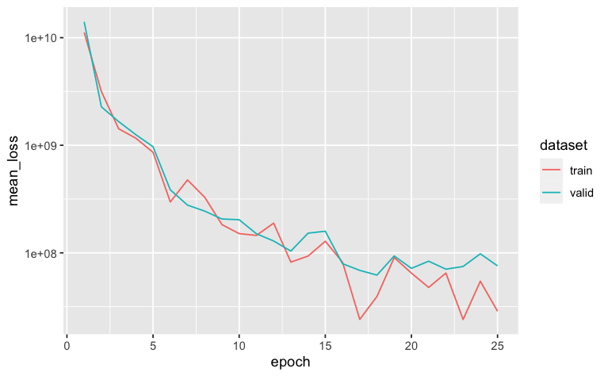
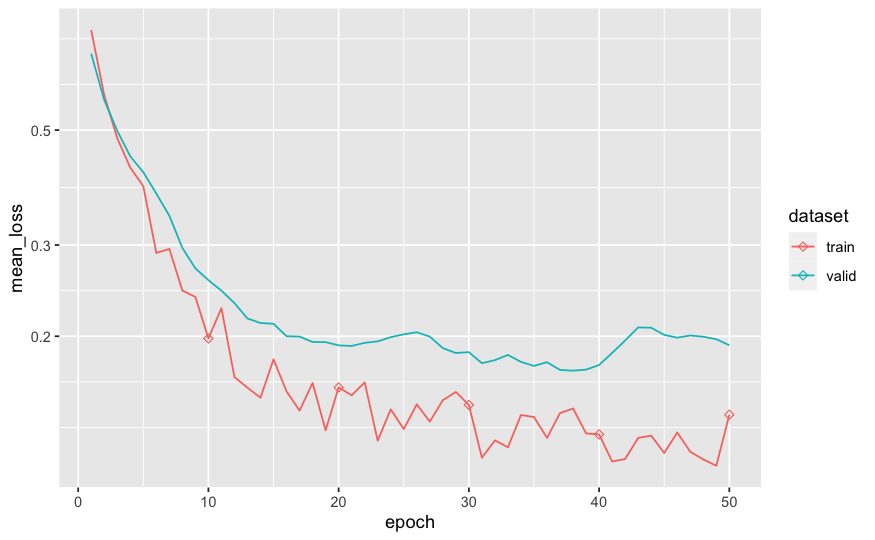
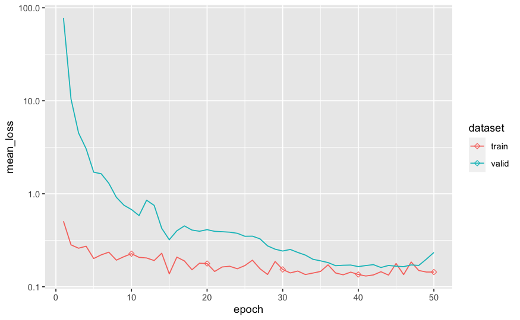

```{r, include = FALSE}
knitr::opts_chunk$set(
  collapse = TRUE,
  comment = "#>",
  eval = FALSE
)
```

```{r setup}
library(tabnet)
library(tidymodels)
library(modeldata)
library(ggplot2)
```

In this vignette we show how to 
 - pretrain TabNet model with unsupervised data
 - fine-tune TabNet with supervised data

We are going to use the `lending_club` dataset available
in the `modeldata` package, using 80 % of it as unsupervised data.

First let's split our dataset into unsupervised and supervised so we can later train the supervised step of the model:

```{r}
set.seed(123)
data("lending_club", package = "modeldata")
split <- initial_split(lending_club, strata = Class, prop = 9/10)
unsupervised <- training(split) %>% mutate(Class=NA)
supervised  <- testing(split)
```

Then we proceed with the  usual split of the supervised dataset into train and test so we can later access performance of our model:

```{r}
set.seed(123)
split <- initial_split(supervised, strata = Class)
train <- training(split) 
test  <- testing(split)
```

## Unsupervised step

We now define our pre-processing steps in a recipe. Note that tabnet handles categorical variables, so we don't need to do any kind of transformation to them. Normalizing the numeric variables is a good idea though.

```{r}
rec_unsup <- recipe(Class ~ ., unsupervised) %>%
  step_normalize(all_numeric()) %>% 
  prep
unsupervised_baked_df <- rec_unsup %>% bake(new_data=NULL) %>% select(-Class)
```

We now have the normalized dataset ready for unsupervised training. 
Next, we pre-train our model. For now, input is  We are going to train for 50 epochs with a batch size of 128. There are other hyperparameters but, we are going to use the defaults.

```{r}
mod <- tabnet_pretrain(x=unsupervised_baked_df, lending_club, epochs = 25, valid_split = 0.2, verbose = TRUE)
```
```
[Epoch 001] Loss: 11191321321.754484 Valid loss: 14043303288.023577                    
[Epoch 002] Loss: 3161280237.272630 Valid loss: 2277820688.039010                      
[Epoch 003] Loss: 1425464713.378328 Valid loss: 1662447124.970019                      
[Epoch 004] Loss: 1163372648.646103 Valid loss: 1255598516.977768                      
[Epoch 005] Loss: 859951108.029864 Valid loss: 968836235.737649                        
[Epoch 006] Loss: 297307497.709330 Valid loss: 385607395.765826                        
[Epoch 007] Loss: 476081664.448208 Valid loss: 277912586.901293                        
[Epoch 008] Loss: 328484951.734496 Valid loss: 244360777.370387                        
[Epoch 009] Loss: 183076239.526333 Valid loss: 206462328.534890                        
[Epoch 010] Loss: 150848889.915168 Valid loss: 203247962.396667                        
[Epoch 011] Loss: 145315826.015203 Valid loss: 150506849.349409                        
[Epoch 012] Loss: 188817877.509315 Valid loss: 128896673.254883                        
[Epoch 013] Loss: 81961035.215651 Valid loss: 103910658.789934                         
[Epoch 014] Loss: 93370595.965209 Valid loss: 152372156.233972                         
[Epoch 015] Loss: 128254766.333159 Valid loss: 158965917.004584                        
[Epoch 016] Loss: 81846709.173152 Valid loss: 79300474.808355                          
[Epoch 017] Loss: 24074313.230707 Valid loss: 68711079.818226                          
[Epoch 018] Loss: 39334039.101522 Valid loss: 62105596.063004                          
[Epoch 019] Loss: 90338776.167679 Valid loss: 93538989.608816                          
[Epoch 020] Loss: 64851167.324570 Valid loss: 71779360.537059                          
[Epoch 021] Loss: 47695435.197353 Valid loss: 83650493.571732                          
[Epoch 022] Loss: 64876198.276327 Valid loss: 70521401.662859                          
[Epoch 023] Loss: 24019925.157223 Valid loss: 74711215.458229                          
[Epoch 024] Loss: 54465801.644086 Valid loss: 97971453.633728                          
[Epoch 025] Loss: 28641401.113068 Valid loss: 75703844.637030  
```

After a few minutes we can get the results:

```{r}
autoplot(mod)
```

We could continue the training here for few epoch as it seems that the validation loss may continue to decrease...
Here we can see that there is a checkpoint available at epoch 20, that provides a lower loss on the validation set than the model available on latest epoch. So we will reuse that checkpoint through the `from_epoch` option for training continuation, instead of the default being last epoch. 

## Continuing training with supervised procedure

Now, we reuse our pre-processing steps recipe and feed it directly in a supervised fitting pass on top of our pre-trained model. 

```{r}
pretrained_model_fit <- tabnet_fit(rec_unsup, train , tabnet_model = mod, valid_split = 0.2, epochs = 50, verbose=TRUE)
```
```
[Epoch 001] Loss: 0.535567 Valid loss: 0.453246                                        
[Epoch 002] Loss: 0.458703 Valid loss: 0.387270                                        
[Epoch 003] Loss: 0.364556 Valid loss: 0.310847                                        
[Epoch 004] Loss: 0.343574 Valid loss: 0.291001                                        
[Epoch 005] Loss: 0.258480 Valid loss: 0.282971                                        
[Epoch 006] Loss: 0.199033 Valid loss: 0.255300                                        
[Epoch 007] Loss: 0.189404 Valid loss: 0.223795                                        
[Epoch 008] Loss: 0.147459 Valid loss: 0.205187                                        
[Epoch 009] Loss: 0.162647 Valid loss: 0.197404                                        
[Epoch 010] Loss: 0.193257 Valid loss: 0.197390                                        
[Epoch 011] Loss: 0.199101 Valid loss: 0.200320                                        
[Epoch 012] Loss: 0.182173 Valid loss: 0.205350                                        
[Epoch 013] Loss: 0.148617 Valid loss: 0.202165                                        
[Epoch 014] Loss: 0.189746 Valid loss: 0.184477                                        
[Epoch 015] Loss: 0.167868 Valid loss: 0.172689                                        
[Epoch 016] Loss: 0.141652 Valid loss: 0.184211                                        
[Epoch 017] Loss: 0.204711 Valid loss: 0.185827                                        
[Epoch 018] Loss: 0.146897 Valid loss: 0.185340                                        
[Epoch 019] Loss: 0.127194 Valid loss: 0.190952                                        
[Epoch 020] Loss: 0.150824 Valid loss: 0.218959                                        
[Epoch 021] Loss: 0.147319 Valid loss: 0.219081                                        
[Epoch 022] Loss: 0.160293 Valid loss: 0.220551                                        
[Epoch 023] Loss: 0.149031 Valid loss: 0.225626                                        
[Epoch 024] Loss: 0.146678 Valid loss: 0.229572                                        
[Epoch 025] Loss: 0.139511 Valid loss: 0.230401                                        
[Epoch 026] Loss: 0.166227 Valid loss: 0.229584                                        
[Epoch 027] Loss: 0.137615 Valid loss: 0.230412                                        
[Epoch 028] Loss: 0.131935 Valid loss: 0.232428                                        
[Epoch 029] Loss: 0.137770 Valid loss: 0.239560                                        
[Epoch 030] Loss: 0.147243 Valid loss: 0.226703                                        
[Epoch 031] Loss: 0.145138 Valid loss: 0.218452                                        
[Epoch 032] Loss: 0.114723 Valid loss: 0.213586                                        
[Epoch 033] Loss: 0.134871 Valid loss: 0.220906                                        
[Epoch 034] Loss: 0.124133 Valid loss: 0.217615                                        
[Epoch 035] Loss: 0.133592 Valid loss: 0.217964                                        
[Epoch 036] Loss: 0.116864 Valid loss: 0.218269                                        
[Epoch 037] Loss: 0.107225 Valid loss: 0.215826                                        
[Epoch 038] Loss: 0.142503 Valid loss: 0.224170                                        
[Epoch 039] Loss: 0.132398 Valid loss: 0.226665                                        
[Epoch 040] Loss: 0.129750 Valid loss: 0.217808                                        
[Epoch 041] Loss: 0.134004 Valid loss: 0.211509                                        
[Epoch 042] Loss: 0.115905 Valid loss: 0.211590                                        
[Epoch 043] Loss: 0.103961 Valid loss: 0.207739                                        
[Epoch 044] Loss: 0.152976 Valid loss: 0.201586                                        
[Epoch 045] Loss: 0.144814 Valid loss: 0.195170                                        
[Epoch 046] Loss: 0.141193 Valid loss: 0.190473                                        
[Epoch 047] Loss: 0.109359 Valid loss: 0.189756                                        
[Epoch 048] Loss: 0.111201 Valid loss: 0.192686                                        
[Epoch 049] Loss: 0.112732 Valid loss: 0.198303                                        
[Epoch 050] Loss: 0.111618 Valid loss: 0.201545 
```
```{r}
autoplot(pretrained_model_fit)
```



And finally, we can verify the results in our test set:

```{r}
test %>% 
  bind_cols(
    predict(pretrained_model_fit, test, type = "prob")
  ) %>% 
  roc_auc(Class, .pred_bad)
```

```
# A tibble: 1 x 3
  .metric .estimator .estimate
  <chr>   <chr>          <dbl>
1 roc_auc binary         0.591
```

## Comparison with no pretraining

The question now is What if we did not pretrain the model ? We can build a vanilla tabnet model on the training set for comparison : 

```{r}
vanilla_model_fit <- tabnet_fit(rec_unsup, train , valid_split = 0.2, epochs = 50, verbose=TRUE)

```

```
[Epoch 001] Loss: 3.954212 Valid loss: 357.003845                                      
[Epoch 002] Loss: 1.657037 Valid loss: 88.164719                                       
[Epoch 003] Loss: 0.770962 Valid loss: 31.805477                                       
[Epoch 004] Loss: 0.517055 Valid loss: 9.380780                                        
[Epoch 005] Loss: 0.377433 Valid loss: 5.324175                                        
[Epoch 006] Loss: 0.388823 Valid loss: 2.053061                                        
[Epoch 007] Loss: 0.500606 Valid loss: 1.649050                                        
[Epoch 008] Loss: 0.265715 Valid loss: 1.097458                                        
[Epoch 009] Loss: 0.370738 Valid loss: 0.574024                                        
[Epoch 010] Loss: 0.359987 Valid loss: 0.606566                                        
[Epoch 011] Loss: 0.283269 Valid loss: 0.628849                                        
[Epoch 012] Loss: 0.329766 Valid loss: 0.701086                                        
[Epoch 013] Loss: 0.336294 Valid loss: 0.558645                                        
[Epoch 014] Loss: 0.351286 Valid loss: 0.468713                                        
[Epoch 015] Loss: 0.282994 Valid loss: 0.420345                                        
[Epoch 016] Loss: 0.241551 Valid loss: 0.436012                                        
[Epoch 017] Loss: 0.149629 Valid loss: 0.449700                                        
[Epoch 018] Loss: 0.293744 Valid loss: 0.446544                                        
[Epoch 019] Loss: 0.181337 Valid loss: 0.343755                                        
[Epoch 020] Loss: 0.200111 Valid loss: 0.343263                                        
[Epoch 021] Loss: 0.156949 Valid loss: 0.350573                                        
[Epoch 022] Loss: 0.173938 Valid loss: 0.348184                                        
[Epoch 023] Loss: 0.148609 Valid loss: 0.337935                                        
[Epoch 024] Loss: 0.212665 Valid loss: 0.374608                                        
[Epoch 025] Loss: 0.205049 Valid loss: 0.309404                                        
[Epoch 026] Loss: 0.161079 Valid loss: 0.356037                                        
[Epoch 027] Loss: 0.174830 Valid loss: 0.365742                                        
[Epoch 028] Loss: 0.151125 Valid loss: 0.352408                                        
[Epoch 029] Loss: 0.165492 Valid loss: 0.344264                                        
[Epoch 030] Loss: 0.200064 Valid loss: 0.357004                                        
[Epoch 031] Loss: 0.205795 Valid loss: 0.315966                                        
[Epoch 032] Loss: 0.146525 Valid loss: 0.344379                                        
[Epoch 033] Loss: 0.116525 Valid loss: 0.355242                                        
[Epoch 034] Loss: 0.172986 Valid loss: 0.336197                                        
[Epoch 035] Loss: 0.203015 Valid loss: 0.414292                                        
[Epoch 036] Loss: 0.138108 Valid loss: 0.434222                                        
[Epoch 037] Loss: 0.151225 Valid loss: 0.410418                                        
[Epoch 038] Loss: 0.155617 Valid loss: 0.455525                                        
[Epoch 039] Loss: 0.211946 Valid loss: 0.447252                                        
[Epoch 040] Loss: 0.165805 Valid loss: 0.442458                                        
[Epoch 041] Loss: 0.198498 Valid loss: 0.436459                                        
[Epoch 042] Loss: 0.150489 Valid loss: 0.447738                                        
[Epoch 043] Loss: 0.172017 Valid loss: 0.449404                                        
[Epoch 044] Loss: 0.148023 Valid loss: 0.438061                                        
[Epoch 045] Loss: 0.154685 Valid loss: 0.432680                                        
[Epoch 046] Loss: 0.138607 Valid loss: 0.382017                                        
[Epoch 047] Loss: 0.160092 Valid loss: 0.343325                                        
[Epoch 048] Loss: 0.171914 Valid loss: 0.317833                                        
[Epoch 049] Loss: 0.170952 Valid loss: 0.304238                                        
[Epoch 050] Loss: 0.173832 Valid loss: 0.284257                                        

```

```{r}
autoplot(vanilla_model_fit)
```


```{r}
test %>% 
  bind_cols(
    predict(vanilla_model_fit, test, type = "prob")
  ) %>% 
  roc_auc(Class, .pred_good)

```

```
# A tibble: 1 x 3
  .metric .estimator .estimate
  <chr>   <chr>          <dbl>
1 roc_auc binary         0.557
```


