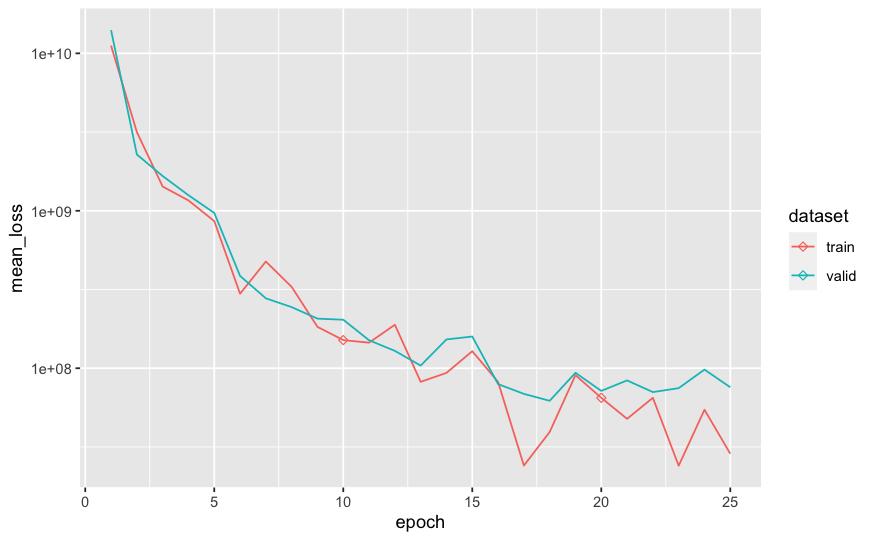

```{r, include = FALSE}
knitr::opts_chunk$set(
  collapse = TRUE,
  comment = "#>",
  eval = FALSE
)
```

```{r setup}
library(tabnet)
library(tidymodels)
library(modeldata)
library(ggplot2)
```

In this vignette we show how to 
 - pretrain TabNet model with unsupervised data
 - fine-tune the pretrained TabNet model with supervised data

We are going to use the `lending_club` dataset available
in the `modeldata` package, using 90 % of it as unsupervised data.

First, let's split our dataset into `unsupervised` and `supervised` datasets, so we can later train the supervised step of the model:

```{r}
set.seed(123)
data("lending_club", package = "modeldata")
split <- initial_split(lending_club, strata = Class, prop = 9/10)
unsupervised <- training(split) %>% mutate(Class=factor(NA))
supervised  <- testing(split)
```

Then we proceed with the usual random split of the supervised dataset into `train` and `test` so that we can evaluate performance of our model:

```{r}
set.seed(123)
supervised_split <- initial_split(supervised, strata = Class)
train <- training(supervised_split) 
test  <- testing(supervised_split)
```

## Data preprocessing

We now define our pre-processing steps in a recipe.  
The `recipe()` here is defined on the whole dataset in order to capture the full variability of numerical variables, as well as all categories present in nominal variables.  
Note that tabnet handles categorical variables, so we don't need to do any kind of transformation to them. Normalizing the numeric variables is a good idea though.

```{r}
rec <- recipe(Class ~ ., lending_club) %>%
  step_normalize(all_numeric())
unsupervised_baked_df <- rec %>% prep %>% bake(new_data=unsupervised)
```

We now have the normalized dataset ready for unsupervised training. 

## Unsupervised training step  

Next, we pre-train our model with a [self-supervised learning](https://paperswithcode.com/task/self-supervised-learning) task. This step will gives us a `tabnet_pretrain` object that will contain a representation of the dataset variables and their interactions.  
We are going to train for 50 epochs with a batch size of 5000 i.e. half of the dataset because it is small enough to fit into memory. There are other hyperparameters available, but we are going to use the default values here.

```{r}
mod <- tabnet_pretrain(rec, unsupervised, epochs = 50, valid_split = 0.2, batch_size = 5000, verbose = TRUE)
```
```
[Epoch 001] Loss: 4.195504 Valid loss: 1.713710                                                                                    
[Epoch 002] Loss: 4.589761 Valid loss: 1.474615                                                                                    
[Epoch 003] Loss: 1.812671 Valid loss: 1.410668                                                                                    
[Epoch 004] Loss: 1.553153 Valid loss: 1.359872                                                                                    
[Epoch 005] Loss: 2.345665 Valid loss: 1.299493                                                                                    
[Epoch 006] Loss: 2.719557 Valid loss: 1.258007                                                                                    
[Epoch 007] Loss: 1.285357 Valid loss: 1.233827                                                                                    
[Epoch 008] Loss: 1.283360 Valid loss: 1.210789                                                                                    
[Epoch 009] Loss: 1.452972 Valid loss: 1.194631                                                                                    
[Epoch 010] Loss: 1.256993 Valid loss: 1.181094                                                                                    
[Epoch 011] Loss: 1.327342 Valid loss: 1.158956                                                                                    
[Epoch 012] Loss: 1.258828 Valid loss: 1.145682                                                                                    
[Epoch 013] Loss: 1.130475 Valid loss: 1.130623
...
[Epoch 041] Loss: 1.002896 Valid loss: 0.950189                                                                                    
[Epoch 042] Loss: 1.142027 Valid loss: 0.944114                                                                                    
[Epoch 043] Loss: 0.940986 Valid loss: 0.940836                                                                                    
[Epoch 044] Loss: 1.032234 Valid loss: 0.939989                                                                                    
[Epoch 045] Loss: 0.947644 Valid loss: 0.937613                                                                                    
[Epoch 046] Loss: 1.007923 Valid loss: 0.935926                                                                                    
[Epoch 047] Loss: 1.721710 Valid loss: 0.938697                                                                                    
[Epoch 048] Loss: 0.984387 Valid loss: 0.941066                                                                                    
[Epoch 049] Loss: 1.092131 Valid loss: 0.944751                                                                                    
[Epoch 050] Loss: 1.175343 Valid loss: 0.947859 
```

After a few minutes we can get the results:

```{r}
autoplot(mod)
```

We may continue the training for few epoch but the validation loss seems to plateau so it is like the model would start to overfit...
Here we can identify on the plot that the model epoch providing the lowest loss on the validation-set is around epoch 35. We will reuse it  through the `from_epoch` option for training continuation, instead of the default being last epoch.   
But historical model weights are only available for checkpoint-ed epoch , so in our case, checkpoint at epoch 40 seems a good compromise, and we would then use `from_epoch=40`.

## Continuing training with supervised task

Now, we reuse our pre-processing steps recipe and feed it directly in a supervised fitting task on top of our pre-trained model. 

```{r}
model_fit <- tabnet_fit(rec, train , tabnet_model = mod, from_epoch=40, valid_split = 0.2, epochs = 50, verbose=TRUE)
```
```
[Epoch 041] Loss: 0.260110 Valid loss: 0.250054                                                                                    
[Epoch 042] Loss: 0.213628 Valid loss: 0.219784                                                                                    
[Epoch 043] Loss: 0.154529 Valid loss: 0.201305                                                                                    
[Epoch 044] Loss: 0.187461 Valid loss: 0.202042                                                                                    
[Epoch 045] Loss: 0.144463 Valid loss: 0.196665                                                                                    
[Epoch 046] Loss: 0.191665 Valid loss: 0.196853                                                                                    
[Epoch 047] Loss: 0.186484 Valid loss: 0.190732                                                                                    
[Epoch 048] Loss: 0.166680 Valid loss: 0.188041                                                                                    
[Epoch 049] Loss: 0.134771 Valid loss: 0.180121                                                                                    
[Epoch 050] Loss: 0.127854 Valid loss: 0.168102   
...
[Epoch 082] Loss: 0.101062 Valid loss: 0.262795                                                                                    
[Epoch 083] Loss: 0.097425 Valid loss: 0.280869                                                                                    
[Epoch 084] Loss: 0.113473 Valid loss: 0.296119                                                                                    
[Epoch 085] Loss: 0.094036 Valid loss: 0.303786                                                                                    
[Epoch 086] Loss: 0.092469 Valid loss: 0.309182                                                                                    
[Epoch 087] Loss: 0.117400 Valid loss: 0.316657                                                                                    
[Epoch 088] Loss: 0.097304 Valid loss: 0.338525                                                                                    
[Epoch 089] Loss: 0.091212 Valid loss: 0.341918                                                                                    
[Epoch 090] Loss: 0.087092 Valid loss: 0.361795 
```
The training continue starting at epoch 41 as expected and ending at epoch 90.  
Now let's diagnose the model training with a new `autoplot()`:

```{r}
autoplot(model_fit)
```


We can see that model starts to overfit after epoch 52 as the validation-set loss reaches its minimum. If we consider epoch 54 to be the epoch to move to production, we can redo the training from checkpoint 50 for 4 epochs : 


```{r}
model_fit <- tabnet_fit(rec, train , tabnet_model = model_fit, from_epoch=50, epochs = 4, valid_split = 0.2, verbose=TRUE)
```

Now, `predict()` and `tabnet_explain()` functions will use the model from last epoch, being here epoch 54.  
Finally, we can measure the results against our test set:

```{r}
test %>% 
  bind_cols(
    predict(model_fit, test, type = "prob")
  ) %>% 
  roc_auc(Class, .pred_bad)
```

```
# A tibble: 1 × 3
  .metric .estimator .estimate
  <chr>   <chr>          <dbl>
1 roc_auc binary         0.653
```

## Comparing against a model without pretraining

The question now is "what if we did not pretrain the model ?" We can build a vanilla tabnet model on the `train` dataset for comparison : 

```{r}
vanilla_model_fit <- tabnet_fit(rec, train , valid_split = 0.2, epochs = 50, verbose=TRUE)

```

```
[Epoch 001] Loss: 0.725771 Valid loss: 0.491390                                                                                    
[Epoch 002] Loss: 0.328243 Valid loss: 0.268964                                                                                    
[Epoch 003] Loss: 0.241829 Valid loss: 0.181927                                                                                    
[Epoch 004] Loss: 0.205124 Valid loss: 0.166245                                                                                    
[Epoch 005] Loss: 0.218578 Valid loss: 0.161050                                                                                    
[Epoch 006] Loss: 0.192196 Valid loss: 0.150333                                                                                    
[Epoch 007] Loss: 0.235362 Valid loss: 0.148007                                                                                    
[Epoch 008] Loss: 0.167538 Valid loss: 0.151358                                                                                    
[Epoch 009] Loss: 0.146265 Valid loss: 0.155682                                                                                    
[Epoch 010] Loss: 0.168639 Valid loss: 0.154740                                                                                    
[Epoch 011] Loss: 0.164683 Valid loss: 0.153092                                                                                    
[Epoch 012] Loss: 0.166895 Valid loss: 0.152931                                                                                    
[Epoch 013] Loss: 0.153897 Valid loss: 0.155470                                                                                    
...
[Epoch 040] Loss: 0.125999 Valid loss: 0.184985                                                                                    
[Epoch 041] Loss: 0.116995 Valid loss: 0.173780                                                                                    
[Epoch 042] Loss: 0.161852 Valid loss: 0.166246                                                                                    
[Epoch 043] Loss: 0.144460 Valid loss: 0.171052                                                                                    
[Epoch 044] Loss: 0.146622 Valid loss: 0.170186                                                                                    
[Epoch 045] Loss: 0.138121 Valid loss: 0.165647                                                                                    
[Epoch 046] Loss: 0.130105 Valid loss: 0.154928                                                                                    
[Epoch 047] Loss: 0.123869 Valid loss: 0.158995                                                                                    
[Epoch 048] Loss: 0.139626 Valid loss: 0.159415                                                                                    
[Epoch 049] Loss: 0.125219 Valid loss: 0.151668                                                                                    
[Epoch 050] Loss: 0.129994 Valid loss: 0.154256                                          

```

```{r}
autoplot(vanilla_model_fit)
```

The model overfits around epoch 20, we will restore it at checkpoint epoch 20 and retrain for 1 epoch , and proceed to prediction : 
```{r}
vanilla_model_fit <- tabnet_fit(rec, train , tabnet_model= vanilla_model_fit, from_epoch=20, valid_split = 0.2, epochs = 1, verbose=TRUE)
test %>% 
  bind_cols(
    predict(vanilla_model_fit, test, type = "prob")
  ) %>% 
  roc_auc(Class, .pred_good)

```

```
# A tibble: 1 x 3
  .metric .estimator .estimate
  <chr>   <chr>          <dbl>
1 roc_auc binary         0.557
```

We can see here a much lower ROC-AUC compared with using the pretraining step. 

